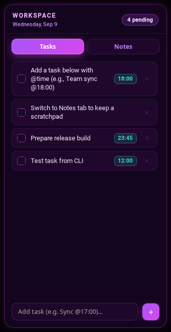
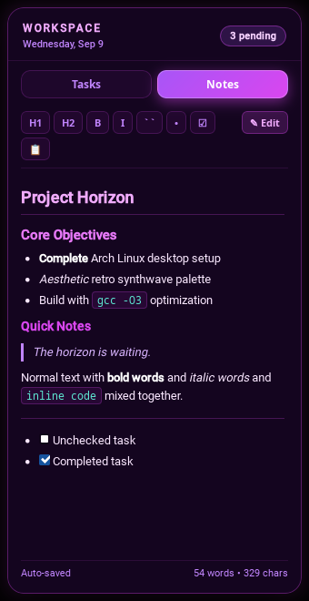

# 🌌 Desktop Tasks & Notes

An aesthetic, ultra-lightweight desktop widget and scratchpad for Arch Linux / XFCE, designed to feel like an organic part of your desktop. Built with **Go** and native **WebKitGTK**.

<p align="center">
  
  &nbsp;&nbsp;&nbsp;&nbsp;
  
</p>

---

## ✨ Features

### 📋 Interactive Tasks & Agenda
- **Smart Time Detection**: Type `@18:00` or `@5pm` (e.g. `Team sync @18:00`) to automatically parse and badge due times.
- **Background Reminders**: Ticker monitors pending tasks and fires native desktop notifications via `notify-send`.
- **Checklist & Quick Add**: Strike-through animations on completion, pending counter badge in header, bottom quick-entry bar.
- **Instant Deletion**: Remove tasks with one click (`✕`).

### 📝 Obsidian-Quality Markdown Notes
- **Flawless Formatting**: Headers (H1–H3), **bold**, *italics*, `inline code`, blockquotes, and code blocks styled in vibrant synthwave colors.
- **Interactive Checklists**: `- [ ]` and `- [x]` markdown checklists are interactive directly within the preview view.
- **Dual Mode (Preview & Edit)**:
  - Toggle between **Preview** and **Edit** mode with the toolbar button, double-clicking the preview, or pressing `Ctrl+E`.
- **Auto-save & Metrics**: Auto-saves to disk on keystroke (debounced 300ms) with live word and character counters.
- **Clipboard Export**: One-click copy for notes.

### 🎨 Retro Synthwave Aesthetics & Desktop Integration
- **Composited Glassmorphism**: Deep violet translucent card with subtle glowing borders (`#d946ef`), matching retro synthwave wallpapers.
- **Desktop Pinning**: Pinned to desktop layer (`keep-below`) with hotkey toggle (`Super + ` ` `) to summon to the foreground.
- **Draggable Header**: Drag-to-move across monitors.
- **Minimal Resource Footprint**:
  - RAM: ~35 MB RSS.
  - CPU: 0.0% when idle.
  - Standalone binary (~6.7 MB) with all assets embedded offline (`//go:embed`).

---

## ⌨️ Shortcuts & CLI

| Shortcut / Command | Description |
| :--- | :--- |
| `Super + ` ` ` | Toggle widget between foreground and background desktop layer |
| `desktop-tasks --toggle` | CLI toggle focus command |
| `desktop-tasks --notes` | Summon widget directly to Notes tab |
| `desktop-tasks --tasks` | Summon widget directly to Tasks tab |
| `desktop-tasks --add "Meeting @15:00"` | Quick add task from terminal, rofi, or scripts |
| `desktop-tasks --test-notification` | Dispatch a test desktop notification |
| `Ctrl + 1` / `Ctrl + 2` | Switch between Tasks and Notes tabs |
| `Ctrl + E` | Toggle Edit / Preview mode in Notes |
| `Escape` | Send widget back down to the desktop layer |

---

## 🚀 Installation & Build

### Prerequisites (Arch Linux)
```bash
sudo pacman -S go gtk3 webkit2gtk-4.1 libnotify
```

### Build & Install
```bash
git clone https://github.com/cluelessbaj/desktop-tasks.git
cd desktop-tasks
make install
```
This builds and installs the binary to `~/.local/bin/desktop-tasks`.

### Autostart on Boot (XDG)
Create `~/.config/autostart/desktop-tasks.desktop`:
```ini
[Desktop Entry]
Type=Application
Name=Desktop Tasks & Notes
Comment=Aesthetic desktop tasks and reminder widget
Exec=/home/deadass/.local/bin/desktop-tasks
Icon=x-office-calendar
Terminal=false
Categories=Utility;
StartupNotify=false
```

### Keyboard Shortcut Binding (XFCE)
1. Open **Settings** -> **Keyboard** -> **Application Shortcuts**.
2. Click **Add**.
3. Command: `/home/deadass/.local/bin/desktop-tasks --toggle`
4. Shortcut: `Super + ` ` ` (tilde/backtick key).

---

## 🛠️ Architecture

```
desktop-tasks/
├── main.go               # App entrypoint, loopback server, JS bindings, CLI flags
├── window.go             # CGo GTK window config (frameless, sticky, keep-below, RGBA)
├── data.go               # Thread-safe JSON persistence (~/.config/desktop-tasks/data.json)
├── ipc.go                # Unix domain socket server/client for instant single-instance IPC
├── reminders.go          # Notification ticker + libnotify dispatcher
├── Makefile              # Build & install targets
├── localwebview/         # Vendored webview engine adapted for webkit2gtk-4.1
├── screenshots/          # Documentation screenshots
└── assets/
    ├── index.html        # App structure
    ├── style.css         # Synthwave stylesheet
    ├── app.js            # Two-way Go/JS bridge
    └── marked.min.js     # Bundled offline Markdown parser
```

---

## 📜 License
MIT License. Created by [cluelessbaj](https://github.com/cluelessbaj).
